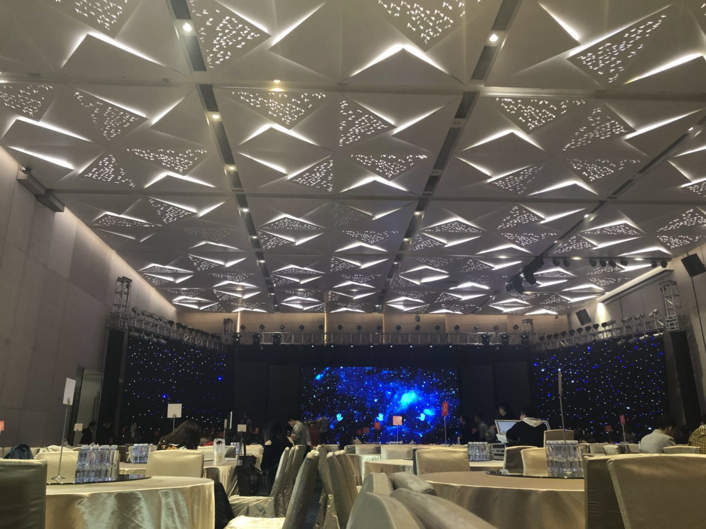
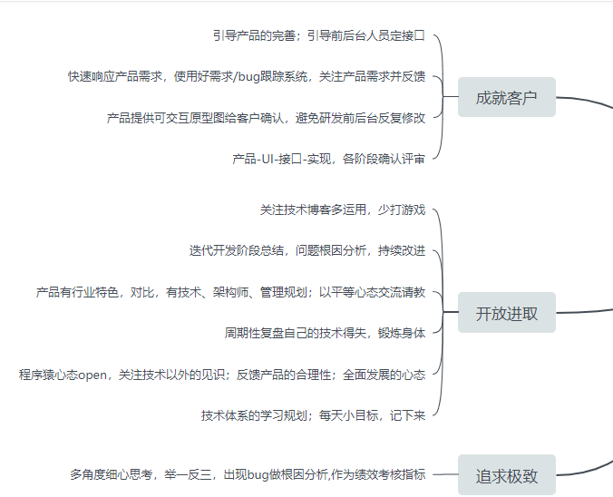
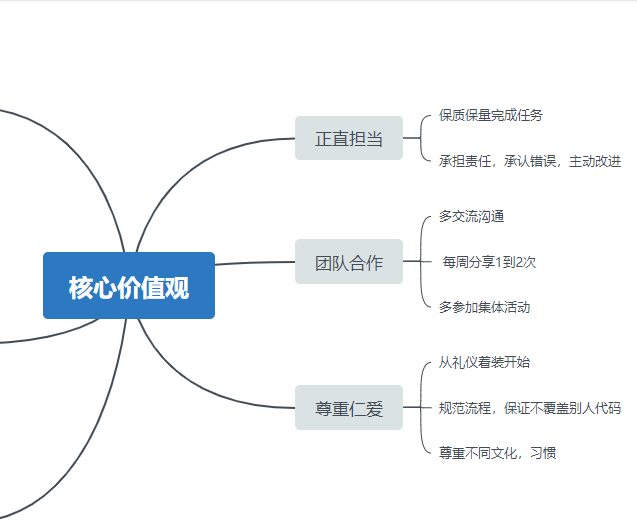

> 这次想要记录一下，公司下发下来的“学习任务”  

### 对公司的感受
自18年7月份入社以来，自己一直在码代码，改前面留下的bug，团队之间大概熟悉了不到一个月，大家都被派到了外面驻场，一直都没回过公司，主要也是因为，这个AI的项目只剩维护的部分，主要功能基本都已经开发完了。留下了我和另外一位其他部门的同事，虽然后期有新的需求，其实都差不多。因此，其实我自己，作为一个实习生，与团队的交流真的少之又少。因此，更加感受不到，所谓的企业文化，所谓的团队精神  

中间有两周，被派到他们驻场的地方“帮忙”，对于经验不足的我来说，很希望能够和大家一起做项目，得到锻炼 。但是，去到那边之后，发现他们的分工已经明确到人，并没有我可以“插手”的地方，并且，QH不会分任务给到我，我猜测，是因为不够信任吧。他让我们在群里发言各自的看法，让我一个都没出力的人，怎么给大家总结、建议？  

上上周参加了公司年会，碰到了，原来在公司的同事以及之前短暂驻场时见过的同事们，确实没好意思过去打招呼，因为，大部分的人都不认识我吧，我这样想。  

其实，还是有很热心的同事的，比如说很厉害但一点都不骄傲的张PD，随性的宝哥，有共同语言的文倩小姐姐，还有开朗的珠梅、能够包容我的不足的楷俊，以及彬彬有礼的峰哥  

我总是跟自己讲，别把自己当个实习生，不然学不到什么东西。可是似乎QH总把我当个实习生。  
所以说：“带你是情分，不带你是本分。”
- - - - 
### 放两张公司的作业图：

- - - -

